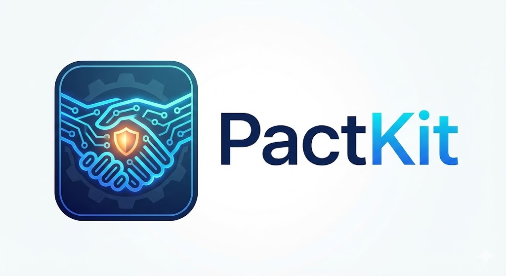

<p align="center">
  
</p>

<p align="center">
  <a href="https://pypi.org/project/pactkit/"></a>
  <a href="https://pypi.org/project/pactkit/"></a>
  <a href="LICENSE"></a>
</p>

<p align="center"><strong>CODE is the Law. Data is the Truth. Prompt is ONLY instruction. AI is ONLY creativity.</strong></p>

> **PactKit** is a governance framework that enforces the **P.A.C.T.** contract between humans and AI coding agents. Deterministic operations run as code, not prompts. Decisions are grounded in data, not memory. AI does what it's best at — creativity and language — while code handles everything that must be repeatable and correct.
>
> 25 CLI subcommands, 9 specialized agents, 11 commands, 10 skills, and a full Plan-Act-Check-Done lifecycle. One `pip install` and your AI assistant follows the contract.

## Installation

```bash
pip install pactkit
```

Requires Python 3.10+.

### Supported AI Tools

| Tool | Deploy Command |
|------|----------------|
| [Claude Code](https://docs.anthropic.com/en/docs/claude-code) | `pactkit init` |
| [OpenCode](https://opencode.ai) | `pactkit init --format opencode` |

## Quick Start

```bash
# Deploy the full toolkit
pactkit init

# Update to latest playbooks (preserves your config)
pactkit update
```

Then in any project:

```bash
/project-plan "Add user authentication"   # Plan: Spec + Board
/project-act STORY-001                     # Act: TDD implementation
/project-check                             # Check: Security + quality audit
/project-done                              # Done: Regression gate + commit
```

Or run the full cycle in one command:

```bash
/project-sprint "Add user authentication"
```

## What It Does

PactKit deploys a complete PDCA (Plan-Do-Check-Act) lifecycle into your AI coding assistant:

- **9 specialized agents** — System Architect, Senior Developer, QA Engineer, Security Auditor, and more
- **11 command playbooks** — From `/project-init` to `/project-release`, each with quality gates
- **10 skills** — Code visualization, sprint board management, scaffolding, and more
- **25 CLI subcommands** — Deterministic operations enforced in Python code, not prompts
- **Safe regression** — TDD-first, pre-existing test protection, spec-driven development

## The P.A.C.T. Contract

```
P   Prompt   is ONLY instruction   Defines process, never state
A   AI       is ONLY creativity    Formatting, language — never deterministic logic
C   Code     is the Law            Sole executor of deterministic operations
T   Truth    Data is the Truth     All judgment based on facts, not memory
```

## PDCA+ Workflow

| Phase | Command | What Happens |
|-------|---------|-------------|
| **Clarify** | `/project-clarify` | Ambiguity detection, structured questions |
| **Plan** | `/project-plan` | Codebase scan, Spec generation, Board entry |
| **Act** | `/project-act` | Spec lint, TDD loop, regression check |
| **Check** | `/project-check` | Security + quality audit + spec alignment |
| **Done** | `/project-done` | Regression gate, archive, conventional commit |
| **Release** | `/project-release` | Version bump, snapshot, Git tag |
| **Sprint** | `/project-sprint` | One-command automated PDCA orchestration |
| **Hotfix** | `/project-hotfix` | Fast-track fix bypassing PDCA |
| **Design** | `/project-design` | PRD generation, story decomposition |

## Documentation

- **Website**: [pactkit.dev](https://pactkit.dev)
- **Changelog**: [CHANGELOG.md](CHANGELOG.md)
- **Issues**: [GitHub Issues](https://github.com/pactkit/pactkit-public/issues)
- **Security**: [SECURITY.md](SECURITY.md)

## Upgrading

```bash
pip install --upgrade pactkit
pactkit update
```

## License

[MIT](LICENSE)
