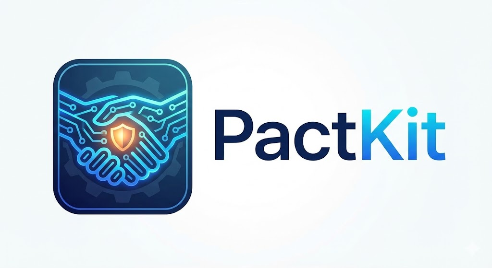

<p align="center">
  
</p>

<p align="center">
  <a href="https://pypi.org/project/pactkit/"></a>
  <a href="https://pypi.org/project/pactkit/"></a>
  <a href="LICENSE"></a>
</p>

<p align="center"><strong>CODE is the Law. Data is the Truth. Prompt is ONLY instruction. AI is ONLY creativity.</strong></p>

> **PactKit** (Pact 契约 + Kit) is a lightweight dev-enablement scaffold: it gives AI coding assistants the standards, specs and methods of a disciplined engineering workflow, without getting in the way. Ordinary questions and ordinary coding never activate the workflow — you opt in per task. There is no admin plane, no central control, and nothing that cannot be uninstalled.
>
> Deterministic operations run as code, not prompts (CODE is the Law). Decisions are grounded in data, not memory (Data is the Truth). 56 CLI subcommands, 9 specialized agents, 12 commands, 25 skills, and a Plan-Act-Check-Done lifecycle you invoke when you want it. One `pip install` deploys to all 4 supported IDEs (adapters are opt-in extras).

### Supported AI Tools

| Tool | Format | Command |
|------|--------|---------|
| **Claude Code** | Classic | `pactkit init` |
| **OpenCode** | OpenCode | `pactkit init` |
| **Codex CLI** | Codex | `pactkit init` |
| **GitHub Copilot** | Copilot | `pactkit init --format copilot` |

> `pactkit init` deploys all 4 IDE formats at once. Use `--format <name>` to target a single IDE.

Gate coverage differs by host: Claude Code and Codex CLI get the full gate set
through native hooks; OpenCode and Copilot fall back to the git-hook layer,
which covers the commit and push gates but not the pre-tool ones
(`auth_gate`, `secrets_gate`, `tamper_guard`, `spec_guard`).

### What it looks like

```
You:  /project-sprint "Add OAuth2 login"

 Plan   System Architect scans codebase, writes Spec, updates Board
 Act    Senior Developer writes tests first (RED), then code (GREEN)
 Check  QA Engineer runs 6-phase audit (security + quality + spec alignment)
 Done   Repo Maintainer gates regression, archives story, commits
```

## The P.A.C.T. Governance Contract

The name says it all — **Pact** means covenant. These four principles define the boundary between human intent and AI execution:

```
P   Prompt   is ONLY instruction   Tells AI how to act — defines process, never state
A   AI       is ONLY creativity    Formatting, summarization, language — never deterministic logic
C   Code     is the Law            Sole executor of deterministic operations — no bypass, no approximation
T   Truth    Data is the Truth     Factual basis for all judgment — no memory, no inference, no fabrication
```

- If a script exists → **use it**. Never reimplement in natural language. (C)
- If data is available → **read it**. Never guess or recall from memory. (T)
- Prompts define HOW, never WHAT. Current state comes from data, not docs. (P)
- AI formats, summarizes, and creates. AI does not parse, compute, or fabricate. (A)

> Read the full philosophy: [docs/architecture/governance/philosophy.md](docs/architecture/governance/philosophy.md)

## Why PactKit?

- **P.A.C.T. Governance** — A contract between humans and AI agents, with clear boundaries
- **Multi-Agent Ensemble** — 9 specialized agents collaborate, each with constrained tools
- **Full PDCA Lifecycle** — Plan -> Act -> Check -> Done, with quality gates at every stage
- **Safe by Design** — TDD-first, safe regression, pre-existing test protection
- **Multi-Tool Support** — Works with Claude Code, OpenCode, and Codex CLI
- **AI-Native SDLC, Operationalized** — The artifact chain, gates, and audit trail that Anthropic's engineering practice describes — running across all 3 hosts

## AI-Native SDLC Alignment

Anthropic's engineering team has published their practice for an AI-native software development lifecycle: six stages, each producing a committed artifact, humans at the gates, and the commit chain as the audit trail. PactKit operationalizes that model today — across all 3 supported hosts:

| AI-Native SDLC | Practice | PactKit mechanism |
|----------------|----------|-------------------|
| Plan — `intent.md` | Ideas become committed artifacts with provenance | `/project-clarify` -> `/project-plan` (Spec + Story, timestamped in git history) |
| Design — `spec.md` | Requirements + design in one pass; policies applied at generation time | Spec generation reads rule modules; `spec_guard` keeps the Spec law during Act |
| Build — `plan.md` | No code before an accepted plan; guardrails as code, not prompt discipline | Spec lint + consistency check gate `/project-act`; enforcement gates enforce what prompts can only state |
| Test — `diff + tests` | Sessions self-verify; steering config is regression-tested | TDD loop + regression gates; `commit-gate` blocks RED suites with skip != pass transparency |
| Deploy — `PR + findings` | Multi-pass review; hooks as allow/ask/block gates | `auth_gate` authorization pairs, `push_gate`, `tamper_guard` — every block and bypass audited |
| Maintain | Incidents feed the next cycle | Gate telemetry + friction stats (`pactkit stats`) decide what to tune next |

Beyond the published practice: the same governance runs on Claude Code, OpenCode, and Codex CLI; interrupted sessions leave machine-observable `outcome_unknown` fences that block resume until the gate re-runs; and every gate decision lands in `.pactkit/enforcement/` as an audit record.

## Installation

```bash
pip install pactkit
```

Requires Python 3.10+ and one of:
- [Claude Code](https://docs.anthropic.com/en/docs/claude-code)
- [OpenCode](https://opencode.ai)
- [Codex CLI](https://github.com/openai/codex)

> The base install ships the **gate chain**: `pre-commit` (Git hook
> scheduling) and `detect-secrets` (credential detection) are standard
> dependencies — no extra required for the default workflow. Host adapters
> remain opt-in extras:

### Optional Extras

```bash
pip install pactkit[opencode]    # OpenCode adapter
pip install pactkit[codex]       # Codex CLI adapter
pip install pactkit[lint]        # Includes ruff for lint gate
pip install pactkit[visualize]   # tree-sitter analyzers (Go/Java/TS complexity, layers)
pip install pactkit[test]        # pytest + tomli (Python 3.10) for the test suite
pip install pactkit[all]         # Everything above
```

### Recommended External Tools

These tools enhance PactKit but cannot be distributed via pip. Run `pactkit deps check` to see what's missing and `pactkit deps install` for guided platform-aware installation:

| Tool | Purpose | Install |
|------|---------|---------|
| [gh](https://cli.github.com) | GitHub CLI (issue sync, release, PR) | `brew install gh` |
| [codegraph](https://www.npmjs.com/package/codegraph) | Code symbol index & call chain analysis | `npm install -g codegraph` |

## Quick Start

```bash
# Deploy to all 3 IDEs at once
pactkit init

# Update to latest playbooks (preserves your custom content in CLAUDE.md)
pactkit update
```

<details>
<summary>Single-IDE deployment</summary>

```bash
# Deploy to one IDE only
pactkit init --format classic    # Claude Code
pactkit init --format opencode   # OpenCode
pactkit init --format codex      # Codex CLI
```
</details>

Then in any project:

```bash
# Clarify — Surface ambiguities before planning
/project-clarify "Add user authentication"

# Plan — Analyze requirements, create Spec
/project-plan "Add user authentication"

# Act — Spec lint + consistency check + TDD implementation
/project-act STORY-001

# Check — Security scan + quality audit (P0-P3 severity)
/project-check

# Done — Regression gate + auto-PR + conventional commit
/project-done
```

Or run the full cycle in one command:

```bash
/project-sprint "Add user authentication"
```

## PDCA+ Workflow

| Phase | Command | Agent | What Happens |
|-------|---------|-------|-------------|
| **Clarify** | `/project-clarify` | System Architect | Ambiguity detection -> Structured questions -> Clarified brief |
| **Plan** | `/project-plan` | System Architect | Clarify gate -> Codebase scan -> Spec generation -> Board entry |
| **Act** | `/project-act` | Senior Developer | Spec lint -> Consistency check -> TDD loop -> Regression check |
| **Check** | `/project-check` | QA + Security | 8-item security checklist + quality audit + spec alignment |
| **Done** | `/project-done` | Repo Maintainer | Regression gate -> Archive -> Conventional commit |
| **Release** | `/project-release` | Repo Maintainer | Version bump -> Snapshot -> Git tag -> GitHub Release |
| **PR** | `/project-pr` | Repo Maintainer | Push branch -> Create pull request via gh CLI |
| **Sprint** | `/project-sprint` | Team Lead | One-command automated PDCA orchestration; empty args = Wave Mode (parallel backlog stories via `spec-graph` waves + conflict matrix) |
| **Hotfix** | `/project-hotfix` | Senior Developer | Fast-track fix bypassing PDCA (with traceability) |
| **Init** | `/project-init` | System Architect | Bootstrap project structure and governance |
| **Design** | `/project-design` | Product Designer | PRD generation -> Story decomposition -> Board setup |

### When to Use What

The core loop is **Plan → Act → Done**. Other commands plug in as needed:

```
You have a task
  │
  ├─ Vague idea, multiple features? ──→ /project-design
  │
  ├─ Unclear requirement? ──→ /project-clarify → /project-plan
  │
  ├─ Clear feature or bug?
  │   │
  │   ├─ Small fix (1 file, obvious)? ──→ /project-hotfix
  │   │
  │   └─ Needs design? ──→ /project-plan → /project-act
  │       │
  │       ├─ Security-sensitive? ──→ /project-check (QA audit)
  │       │
  │       └─ /project-done
  │           │
  │           ├─ On feature branch? ──→ /project-pr
  │           └─ Ready to release? ──→ /project-release
  │
  └─ Fully automated? ──→ /project-sprint (runs all phases)
```

**Solo developer?** Start with `/project-plan` → `/project-act` → `/project-done`. Add `/project-hotfix` for small fixes and `/project-check` when security matters.

### Embedded Skills (auto-invoked by commands)

| Skill | Embedded In | Purpose |
|-------|-------------|---------|
| Trace | Plan Phase 1, Act Phase 1 | Deep code tracing and execution flow analysis |
| Release | Release Phase 1 | Version release: snapshot, archive, Git tag |

### Agent Skills (invoked via agent roles)

| Skill | Available To | Purpose |
|-------|-------------|---------|
| Draw | visual-architect, system-architect | Generate Draw.io XML architecture diagrams |
| Status | system-medic | Project state overview |
| Doctor | system-medic | Diagnose project health |
| Review | qa-engineer | PR Code Review |
| Analyze | senior-developer (Act inline) | Cross-artifact consistency check: Spec <-> Board <-> Test Cases |

## Agent Ensemble

PactKit deploys 9 specialized agents, each with constrained tools and focused responsibilities:

| Agent | Role | Core Capability |
|-------|------|----------------|
| System Architect | Architecture design | Maintain Intent Graph, write Specs |
| Senior Developer | Full-stack development | TDD loop, call chain analysis, hotfix |
| QA Engineer | Quality gates | Deep check (P0-P3), PR review |
| Security Auditor | Security audit | OWASP scanning, threat modeling |
| Repo Maintainer | Repository ops | Cleanup, archiving, Git conventions, releases |
| System Medic | System diagnostics | Configuration drift repair |
| Visual Architect | Architecture visualization | Draw.io XML generation |
| Code Explorer | Code tracing | Call graph + sequence diagram |
| Product Designer | Product design | PRD, story decomposition, board init |

## Skills

PactKit deploys 25 skills. That total is the 12 PDCA commands (registered as
skills, so `/project-plan` and `pactkit-visualize` deploy the same way) plus the
13 tool skills below, auto-invoked by commands:

13 tool skills (4 scripted + 9 prompt-only):

| Skill | Type | Purpose |
|-------|------|---------|
| **pactkit-visualize** | Scripted | Code analysis + MMD views rendered from the Codegraph index |
| **pactkit-board** | Scripted | Sprint board operations: add story, update task, archive |
| **pactkit-scaffold** | Scripted | File scaffolding: create spec, test files, git branches, skills |
| **pactkit-report** | Scripted | Interactive HTML dashboard from Mermaid architecture graphs |
| **pactkit-trace** | Prompt-only | Deep code tracing and execution flow analysis |
| **pactkit-draw** | Prompt-only | Generate Draw.io XML architecture diagrams |
| **pactkit-analyze** | Prompt-only | Cross-artifact consistency check: Spec <-> Board <-> Test Cases |
| **pactkit-audit** | Prompt-only | H1-H7 AI readiness assessment and hotspot analysis |
| **pactkit-status** | Prompt-only | Cold-start project overview (sprint + git + health) |
| **pactkit-doctor** | Prompt-only | Configuration drift detection and health report |
| **pactkit-garden** | Prompt-only | Codebase quality patrol: dead code, stale docs, duplication |
| **pactkit-review** | Prompt-only | PR code review with SOLID/Security/Quality checklists |
| **pactkit-release** | Prompt-only | Version bump, architecture snapshot, git tag |

## CLI Subcommands

PactKit ships 56 deterministic CLI subcommands — operations that were previously delegated to AI prompts are now enforced in Python code (the "C" in P.A.C.T.):

| Command | Purpose |
|---------|---------|
| `pactkit init` | Deploy toolkit to AI coding assistant |
| `pactkit update` | Update playbooks (preserves config) |
| `pactkit upgrade` | Upgrade with format selection |
| `pactkit adopt` | Create a minimal versioned contract for the current project |
| `pactkit reconcile` | Preview or apply safe project-schema migrations |
| `pactkit project-preflight` | Check adoption and compatibility before governed work |
| `pactkit version` | Show installed version |
| `pactkit schema` | Print document schemas |
| `pactkit doctor` | Diagnose project health (HLD drift, board, config, deployment content parity, adapter skew) |
| `pactkit spec-lint` | Validate spec structure (E001-E010, W001-W011; incl. dependency surface checks) |
| `pactkit spec-graph` | Story dependency DAG: topological execution waves + file-conflict matrix (`--json` for orchestrators, `--write-graph` for Mermaid) |
| `pactkit spec-status` | Update spec Status field (Draft/In Progress/Done) |
| `pactkit guard` | Check project init markers |
| `pactkit generate-id [--type story\|hotfix\|bug]` | Generate a decentralized time-prefixed item ID |
| `pactkit context` | Generate `context.md` from project state |
| `pactkit clean` | Remove stack-specific temp artifacts |
| `pactkit secrets-baseline` | Surgically realign `.secrets.baseline` after a golden refresh changed a recorded digest — updates only the entries whose hash actually changed, preserves key order / indent / no-trailing-newline / `generated_at`, and never accepts a new finding on its own (it reports them for review) |
| `pactkit lint` | Stack-aware lint with auto-fix and blocking modes |
| `pactkit regression` | Classify changes (SKIP/FULL/IMPACT) |
| `pactkit test-map` | Map source files to test files |
| `pactkit coverage-gate` | Enforce 3-tier coverage thresholds (80/50/block) |
| `pactkit visualize` | Render MMD diagrams **from the Codegraph index** (`--mode file\|class\|call\|module`, `--lazy`) |
| `pactkit query` | Codegraph queries (the single source): `--callers`, `--callees`, `--chain`, `--impact`, `--explore` |
| `pactkit lesson-append` | Append lesson with specificity check and dedup |
| `pactkit invariants-refresh` | Update test count invariant in rules.md |
| `pactkit sec-scope` | Detect security scope for changed files |
| `pactkit backfill-release` | Replace Release: TBD in completed specs |
| `pactkit issue-sync` | GitHub issue lifecycle for BUG/HOTFIX items |
| `pactkit lint-context` | Validate context.md structure |
| `pactkit lint-lessons` | Validate lessons.md structure |
| `pactkit lint-testcase` | Validate test case structure |
| `pactkit done-verify` | Archive honesty gate: requirement→test evidence chain, checkbox↔case consistency, status machine (blocks `/project-done` on FAIL) |
| `pactkit commit-gate` | Pre-commit test gate with skip≠pass transparency; stack-aware (pytest/npm test/go test/mvn/gradle); counts via junitxml — immune to repo `addopts` verbosity tricks; `--full` for the complete local suite; `--install --migrate` moves an existing project onto the pre-commit chain |
| `pactkit gate` | Session context hooks (`--hook session-start/pre-compact`) + external-effect authorization (`pactkit gate <scope> [--ttl-minutes N]`) |
| `pactkit deps` | External dependency check (`deps check`) and guided install (`deps install`) for node/codegraph/gh |
| `pactkit schema config` | List every pactkit.yaml key with default, effective value, and source |
| `pactkit sync` | Sync codegraph index |

### Commit Path Convergence (2.26.0)

- **Single test executor**: worktree and `core.hooksPath` layouts resolve the
  real git hooks path — the host PreToolUse pass defers to the shared git
  pre-commit hook instead of double-running the suite.
- **Real incremental selection**: a changed test file maps to itself
  (`test_X.py` runs `test_X.py`); an empty mapping runs the fast layer with an
  explicit full-suite recommendation instead of silently escalating; polyglot
  repos run every detected workspace's native test command.
- **Observability**: the gate prints its plan (strategy, reason, command,
  scope) before any test runs, streams pytest output, and records per-phase
  timings into the enforcement record.
- **Staged-first scope**: the gate checks what this commit will introduce
  (`git diff --cached`); unstaged work is reported as excluded.

### Verification Facts & Governance (2.26.0)

- Verification records are keyed by **content fingerprint** (cross-story
  reuse); with no fresh, unambiguous preflight receipt the post-commit stamp
  lands **unattributed** instead of guessing a story.
- PreCompact writes a lightweight marker — one context generation per
  compaction cycle.
- The spec guard binds a receipt only while its spec hash matches and the
  receipt is fresh (expired/drifted receipts unlock with a reason).
- `telemetry.enabled: false` skips event-stream writes without touching gate
  semantics.

### Engineering Guidance by Gap (2.26.0)

- The reuse classification (availability / applicability / decisions /
  evidence) lives once in the shared lifecycle capsule loaded by all four
  phases; Act loads guidance by gap — an empty `pactkit risk` result is never
  "no risk", 0 guides is valid when there is no gap, and confirmed risks
  past the first three are still read and verified.
- `pactkit risk --json` returns the full per-concern decisions for review.

### Enforcement Gates (2.25.0)

The hook layer enforces the rules prompt text can only state — protected branches, specs, credentials, and external effects survive a conflicting instruction instead of losing to it:

| Gate | Blocks | Bypass (human/config only) |
|------|--------|---------------------------|
| `push_gate` | Direct push to a protected branch (default `main`/`master`) | `PACTKIT_ALLOW_DIRECT_PUSH=1` or `enforcement.allow_direct_push` |
| `commit_gate` | Commits on protected branches (default) and RED test suites | same as push_gate; `commit_gate.test_policy: fast` (default) scopes tests by mapping and marks `requires_full_suite` instead of escalating |
| `spec_guard` | Editing a spec that has an active preflight receipt (Spec is Law during Act) | `PACTKIT_ALLOW_SPEC_EDIT=1` via the `!` prefix — human channel only; the agent cannot authorize this one |
| `auth_gate` | External-effect commands (PR/release/publish/repo) until the user confirms | `pactkit gate <scope>` TTL token or `PACTKIT_AUTHORIZED=1` |
| `secrets_gate` | Literal credential material in commands (env-var indirection is exempt) | `PACTKIT_ALLOW_SECRET=1` |
| `tamper_guard` | Modifying enforcement artifacts (hooks, gate registrations, audit records, `pactkit.yaml`, settings env) | `PACTKIT_ALLOW_CONFIG_EDIT=1` |

All blocks/bypasses are audited (`.pactkit/enforcement/`) and feed `pactkit stats` as gate telemetry (per-gate block counts, per-command invocation counts, authorization pairs) — the friction data that decides what to tune next.

### Gate Chain: pre-commit + detect-secrets (3.0.0)

The Git-hook layer is **pre-commit** (the upstream scheduler) plus
**detect-secrets** (the upstream credential engine) — both standard install
dependencies, so a plain `pip install` gets the full chain:

| Layer | Owner | Notes |
|-------|-------|-------|
| Hook install & scheduling | pre-commit | generated config uses `repo: local` + `language: system` — no second hook environment |
| Staged-file credential scan | detect-secrets | upstream `detect-secrets-hook`, reached through PactKit's entry; your baseline is honored, never auto-generated |
| PactKit domain check | PactKit (thin entry) | branch policy, fast test selection, spec rules — one execution per commit |
| Command-text credential scan | detect-secrets (in-process API) + a small shell-pattern set | no shell interpolation of secrets, no per-command CLI |
| Push policy | PactKit (thin entry) | pre-push reads the target branch from `PRE_COMMIT_*` env; no tests run |

The generated `.pre-commit-config.yaml` is **shareable**: entries name
`pactkit` on PATH (never a machine-local absolute path), so the same file
works for every developer, on Linux CI, and after a reinstall. Install
PactKit per machine (`pipx install pactkit`); if it is missing, pre-commit
stops the commit with `Executable \`pactkit\` not found` — a loud failure,
never a silent pass.

**pre-push limits** (pre-commit's own behaviour, printed by `pactkit doctor`
and listed in the [support matrix](docs/guides/support-matrix.md)): a push
carrying several refspecs surfaces only its **first** ref to the policy, and
deleting a remote ref does not run the pre-push stage at all. Protected-branch
deletion protection belongs on the server, not in a local hook.

Migrate an existing project with `pactkit commit-gate --install --migrate`
(preflight read-only: `pactkit commit-gate --install --check`) — it also
rewrites entries an older PactKit recorded as absolute paths. The **first
pactkit command in a project after an install or upgrade** runs a one-time
project-level check (config drift, graph views, gate chain) and reports the
exact next command for each finding — nothing is modified.

### Codegraph is the single source of code facts (3.0.0)

Code-relationship data comes from **Codegraph**: queries
(`pactkit query --callers/--callees/--chain/--impact/--explore`), audit
insights, and diagrams all read the same index. `pactkit visualize` **renders**
`docs/architecture/graphs/*.mmd` as human-readable views from that index — no
self-built scanner, and no index means a clear error (`pactkit sync` first),
never a silent fallback.

The legacy MMD tracing engine is retired. Your existing `.mmd` files are never
deleted or rewritten for you — `pactkit doctor` lists verifiably-old tracing
outputs with per-file cleanup advice, and manual diagrams (`system_design`,
`workflow`, Spec diagrams) remain first-class.

## Deployment Architecture

PactKit supports four deployment formats:

### Claude Code (Classic)

```
~/.claude/
├── CLAUDE.md                 <- Project context entry point
├── rules/                    <- 21 rule modules (loaded per-command, not globally)
├── skills/                   <- 25 skill packages (12 commands + 13 tool skills)
└── agents/                   <- 9 agent definitions
```

Commands are deployed as skills (`skills/project-*/SKILL.md`), invoked with `/project-plan`.

### OpenCode

```
~/.config/opencode/
├── AGENTS.md                 <- On-demand @reference index (lazy rule loading)
├── rules/                    <- 21 rule modules
├── commands/                 <- 12 command playbooks (auto-discovered, invoked via /)
├── agents/                   <- 9 agent definitions (mode: subagent)
├── skills/                   <- 13 tool skills (AI agent loads on demand)
└── opencode.json             <- Global config (model routing, instructions)
```

OpenCode uses dual mechanism: `commands/` for user-facing PDCA entry points, `skills/` for AI-invoked tools.

### Codex CLI

```
~/.codex/
├── AGENTS.md                 <- Global constitution
├── config.toml               <- Model, sandbox, MCP config
├── rules/                    <- 21 rule modules
├── skills/                   <- 25 skill packages (12 commands + 13 tool skills)
└── .pactkit-version          <- Version marker for updates
```

Commands are deployed as skills (`skills/project-*/SKILL.md`), invoked with `$project-plan`.

## Multi-Developer Collaboration

PactKit supports multi-developer workflows with Story ID prefixing:

```yaml
# In pactkit.yaml
developer: alice
```

Story IDs become `STORY-alice-001`, preventing merge conflicts when multiple developers work on separate branches.

## Project Structure (PDCA-managed)

PactKit's PDCA lifecycle manages a `docs/` directory:

```
docs/
├── product/
│   ├── stories/                 <- One workflow/task fact file per Story
│   └── sprint_board.md          <- Optional generated read-only projection
├── specs/                       <- The Law — requirement specifications
├── test_cases/                  <- Gherkin acceptance scenarios
└── architecture/
    ├── graphs/                  <- Architecture graph files (Mermaid .mmd)
    ├── governance/
    │   ├── rules.md             <- Architecture decisions and invariants
    │   └── lessons/             <- One immutable record per lesson
    └── snapshots/               <- Versioned architecture graph snapshots
```

Session context is generated locally at `.pactkit/context.md` and is ignored by Git.

### pactkit.yaml Configuration Reference

**Which file is read** (per-host since 2026-09-18). Config resolves in layers,
lowest precedence first:

| Layer | Path | Applies to |
|-------|------|-----------|
| Shared | `pactkit.yaml` (repository root) | Every host, and everything with no host signal — a plain terminal, CI, and the Git hooks (pre-commit/pre-push are host-agnostic: there is no terminal to ask) |
| Host | `.claude/pactkit.yaml` (Claude Code), `.codex/pactkit.yaml` (Codex), `.opencode/…`, `.github/…` (Copilot) | The matching terminal, overriding the shared layer key by key |

So a Claude Code session reads `pactkit.yaml` **then** `.claude/pactkit.yaml`;
a bare-terminal `git commit` reads `pactkit.yaml` alone. Put policy that must
hold everywhere in the shared file, and per-terminal differences in the host
file. `pactkit schema config` prints the host, the layers, and each key's
source; `pactkit doctor` prints the layers too. Copies are no longer flattened
automatically — `pactkit update --sync-config-copies` does that, explicitly,
when you want one shared config after all.

| Field | Type | Default | Description |
|-------|------|---------|-------------|
| `stack` | string | auto-detected | Project stack (`python`, `node`, `go`, `java`) |
| `developer` | string | `""` | Developer prefix for Story IDs (multi-developer collaboration) |
| `agents` | list | all 9 | Agent definitions to deploy |
| `commands` | list | all 12 | Command playbooks to deploy |
| `skills` | list | all 25 | Skills to deploy (12 commands + 13 tool skills) |
| `rules` | list | all 21 | Constitution rule modules to deploy |
| `enforcement` | object | see below | Gate configuration — `protected_branches` (`["main","master"]`), `allow_direct_push` (`false`), `tamper_guard` (`true`), `spec_guard` (`true`), `auth_gate` (`true`), `secrets_gate` (`true`), `auth_ttl_minutes` (`30`) |
| `telemetry` | object | `enabled: true` | Local-only usage telemetry (`.pactkit/events/`). Set `enabled: false` to stop recording; gate verdicts are unaffected |
| `exclude` | object | `{}` | Components to exclude (e.g., `exclude.agents: [agent-name]`) |
| `visualize.graph_provider` | string | (absent) | Code-relation backend. Absent/`auto` = Codegraph (the single source). Explicit `builtin_graph` returns a retirement notice — the MMD-based provider is gone |
| `ci` | object | `provider: none` | CI/CD pipeline generation (`github`, `gitlab`, `none`). Sub-fields: `runner` (default: `ubuntu-latest`), `language_version` (default: auto per stack), `github_host` (GHE server address), `actions_ref` (GHE actions prefix) |
| `issue_tracker` | object | `provider: none` | External issue tracker (`github`, `none`) |
| `hooks` | object | disabled | Opt-in hook templates (pre-commit, post-test, pre-push) |
| `lint_blocking` | bool | `false` | Whether lint failures block commits |
| `auto_fix` | bool | `false` | Whether to auto-fix lint errors |
| `agent_models` | object | `{}` | Per-agent model overrides (`haiku`, `sonnet`, `opus`, `inherit`) |
| `command_models` | object | defaults | Per-command model overrides for OpenCode deployment |
| `write_scope` | object | (absent) | Declare `source_roots`/`test_roots`/`docs_roots` for non-standard directory layouts (e.g. `frontend/src`, `backend/`, `directus-extensions/`). It informs optional workflow integrations and project tooling; normal `project-act` work remains in the current session and is never blocked by a stale workflow scope. |

## Safe Regression

PactKit's safe regression system prevents agents from blindly modifying pre-existing tests:

- **TDD Loop** — Only iterates on tests created in the current story
- **Regression Check** — Read-only gate; pre-existing test failure = STOP and report
- **Done Gate** — Full regression by default; incremental only when ALL safety conditions are met

## Hierarchy of Truth (the "T" in P.A.C.T.)

```
Tier 1: Specs & Test Cases           <- The Law (CODE is the Law)
Tier 2: Tests                        <- The Verification (DATA is the Truth)
Tier 3: Implementation               <- The Mutable Reality
```

When conflicts arise: Spec wins. Always. The agent modifies code, never the spec.

## MCP Integration

As of **2.26.0**, PactKit is a lightweight development-enablement scaffold with
**zero MCP server injection** — `pactkit init` no longer registers any server,
and the self-hosted governance MCP server is retired (`pactkit mcp` prints the
retirement note and migration path). Host-side MCP servers you configure
yourself (Context7, Playwright, Chrome DevTools, Memory, …) still work: the
playbooks reference them conditionally and skip gracefully when unavailable.

| MCP Server | Purpose | PDCA Phase |
|------------|---------|------------|
| Context7 | Library documentation lookup | Act |
| Playwright | Browser automation testing | Check |
| Chrome DevTools | Performance/console/network | Check |
| Memory | Cross-session knowledge graph | Plan/Act/Done |

All MCP instructions are conditional — gracefully skipped when unavailable.

## Upgrading

```bash
pip install --upgrade pactkit
pactkit update    # Updates all deployed IDEs
```

Use `pactkit update --format <name>` to update a single IDE.

Rolling back is `pip install pactkit==<previous-version>` followed by
`pactkit update` (pin the adapters to the same window in the same command).
`pactkit doctor` reports a deployment whose files no longer match the
installed CLI, which is how a partial rollback shows up.

After an upgrade, the first pactkit command in each project runs a one-time
project-level check (config drift, graph views, gate chain) and reports the
exact next command for anything stale — see *Gate Chain* above. It is
read-only and runs once per project per version.

**Upgrading from a version older than 2.27.0?** Audit records written before
2.27.0 could persist credential-shaped text — run the one-time sweep in the
[credential incident response guide](docs/guides/credential-incident-response.md)
before calling the upgrade done.

### Upgrading to 3.0.0

3.0.0 replaces the Git-hook layer and the credential engine, and changes how
`pactkit.yaml` is found. Nothing runs automatically — here is the whole list:

| What changed | What to do |
|--------------|-----------|
| **New standard dependencies** — `pre-commit` (the only Git-hook scheduler) and `detect-secrets` (the credential engine) now ship with the base install | Nothing: `pip install --upgrade pactkit` brings them. `pipx install pactkit` also works; `detect-secrets-hook` is reached through PactKit, so it does not need to be on your PATH |
| **Old PactKit Git hooks are replaced** by pre-commit shims | Per project: `pactkit commit-gate --install --check` (read-only), then `--install --migrate`. Pristine old wrappers are backed up (`.pre-pactkit-migration`) and removed; hooks you edited yourself are never touched — the migration stops and lists them |
| **`.pre-commit-config.yaml` entries are shareable** | Generated configs name `pactkit` on PATH instead of an absolute path, so they work for every developer and on CI. A migration rewrites the absolute entries an older PactKit wrote; `pactkit doctor` flags any that remain |
| **Codegraph is the single source of code facts; MMD files are rendered views** | `pactkit sync` builds the index, `pactkit visualize` renders `docs/architecture/graphs/*.mmd` **from** it. The old self-built scanner is gone: with no index, `visualize` fails with a clear message instead of falling back. Old tracing-only outputs (`call_graph.db`, `reverse_call_graph.mmd`, `focus_file_graph.mmd`, `unified_graph.mmd`) are listed by `pactkit doctor` as cleanup candidates — never deleted for you |
| **pre-push checks have framework limits** | A push with several refspecs surfaces only its **first** ref to the policy, and deleting a remote ref does not run the pre-push stage at all. Protected-branch deletion protection belongs on the server. `pactkit doctor` prints both limits |
| **`pactkit.yaml` is read per terminal** | A shared `pactkit.yaml` at the repository root applies to every host and to everything with no host signal (plain terminal, CI, Git hooks); `.claude/`, `.codex/` etc. override it key by key. Put `enforcement.*` in the shared file. `pactkit schema config` prints the host and the layers |

Rolling back a 3.0.0 upgrade: `pip install pactkit==2.27.0` (and the adapters in
the same command), then `pactkit update`. To restore the old Git hooks as well,
`pactkit commit-gate --uninstall-chain` removes PactKit's entries and shims
without touching your own checks or your baseline.

## Restricted and CI Environments

`pactkit init` and `pactkit update` accept flags for environments that cannot
reach the network or answer prompts:

| Flag | Effect |
|------|--------|
| `--no-git` | Skips every git operation (hook installation, `.gitignore` edits) — for air-gapped or git-less setups |
| `--no-external` | Skips external network calls (MCP registration, `gh` CLI, `pip`) |
| `--non-interactive` | Auto-accepts defaults — for CI/CD |

PactKit never sends your code or usage data anywhere. Telemetry is written
locally under `.pactkit/events/` and can be turned off with
`telemetry.enabled: false`. The only network access is the package index you
install from.

## Troubleshooting

Start with `pactkit doctor` — it reports configuration drift, deployment
parity against the installed CLI, adapter version skew, hook registration, and
rule health. `pactkit doctor --json` emits the same data for scripts.

| Symptom | Likely cause | What to do |
|---------|--------------|------------|
| A commit is blocked with `commit-gate` | Tests are RED, or you are committing directly to a protected branch | Fix the tests, or push a feature branch and open a PR. `enforcement.allow_direct_push: true` is for single-maintainer repos that work directly on `main` |
| A command is blocked with `push-gate` / `auth-gate` | Direct push to a protected branch, or an external-effect command (`gh pr create`, `npm publish`, …) without authorization | Run `pactkit gate authorize <scope>` after the user agrees, or have the user run it themselves |
| A spec edit is blocked with `spec-guard` during Act | The spec has a live preflight receipt (Spec is Law) — this key is deliberately not agent-issuable | Finish the implementation, route the change through `/project-plan`, or run the edit yourself with the `!` prefix and `PACTKIT_ALLOW_SPEC_EDIT=1` |
| Gates behave inconsistently across teammates | Deployments are stale — each clone updates independently | `pactkit update` in that project, then `pactkit doctor` |
| Different gates fire on different hosts | OpenCode/Copilot only get the git-hook layer — the four pre-tool gates do not exist there | See the [support matrix](docs/guides/support-matrix.md); put the hard controls (branch protection, required CI) server-side |
| `pactkit doctor` reports adapter skew | `pactkit-codex`/`-opencode` version does not match core | Upgrade the adapter extras; core and adapters are version-pinned to each other |
| The gate blocks work and you believe it is wrong | Genuine gate bug | `PACTKIT_ALLOW_*` env vars (see the gate table above) are the human channel; report the false positive with `pactkit stats` output |

Further reading: the [support matrix](docs/guides/support-matrix.md) (hosts ×
gates × platforms, what each host actually gets), the [credential incident
response guide](docs/guides/credential-incident-response.md) (pre-2.27.0
audit-record sweep), and the [release & recovery
runbook](docs/guides/release-recovery-runbook.md) (second-person drill —
build, verify, release, recover from the shipped artifacts).

## Contributing

See [CONTRIBUTING.md](CONTRIBUTING.md) for guidelines.

## License

[MIT](LICENSE)
